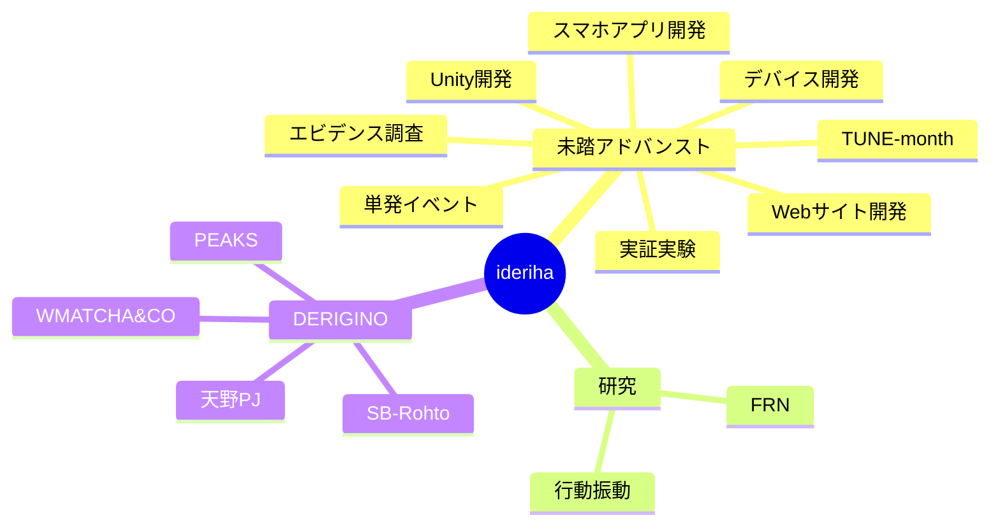

# Dashboard

最終更新: 2026-04-06

## 全体マップ

## プロジェクト一覧

### 未踏アドバンスト

| サブプロジェクト | 未完了タスク | 直近の期限 | リンク |
|----------------|------------|-----------|-------|
| Unity開発 | 0 | - | [tasks](projects/mitou-advanced/unity/tasks.md) |
| スマホアプリ開発 | 0 | - | [tasks](projects/mitou-advanced/smartphone-app/tasks.md) |
| Webサイト開発 | 0 | - | [tasks](projects/mitou-advanced/website/tasks.md) |
| 単発イベント関連 | 0 | - | [tasks](projects/mitou-advanced/single-events/tasks.md) |
| 実証実験関連 | 0 | - | [tasks](projects/mitou-advanced/field-experiment/tasks.md) |
| TUNE-month関連 | 9 | - | [tasks](projects/mitou-advanced/tune-month/tasks.md) |
| デバイス開発関連 | 0 | - | [tasks](projects/mitou-advanced/device/tasks.md) |
| エビデンス調査 | 2 | - | [tasks](projects/mitou-advanced/evidence-research/tasks.md) |

### 研究関連

| サブプロジェクト | 未完了タスク | 直近の期限 | リンク |
|----------------|------------|-----------|-------|
| 行動振動関連 | 0 | - | [tasks](projects/research/behavioral-vibration/tasks.md) |
| FRN関連 | 0 | - | [tasks](projects/research/frn/tasks.md) |

### DERIGINO関連

| サブプロジェクト | 未完了タスク | 直近の期限 | リンク |
|----------------|------------|-----------|-------|
| PEAKS関連 | 6 | - | [tasks](projects/derigino/peaks/tasks.md) |
| SB-Rohto関連 | 0 | - | [tasks](projects/derigino/sb-rohto/tasks.md) |
| 天野PJ関連 | 0 | - | [tasks](projects/derigino/amano-pj/tasks.md) |
| WMATCHA&CO連携 | 0 | - | [tasks](projects/derigino/wmatcha-co/tasks.md) |

## 今週の重要タスク

- **[PEAKS]** 契約書の締結日確定・作業工程表・仕様書の確認
- **[PEAKS]** 支払条件の見直し条項を追加・Monello社と協議
- **[PEAKS]** 単語出題アルゴリズムの設計・整理
- **[TUNE-month]** ターゲット層の明確化・プラットフォーム選定（コミュニティ立ち上げ準備）
- **[TUNE-month]** X・Instagramアカウント作成
- **[エビデンス調査]** PMC10744364の開眼/閉眼条件をOpenNeuroデータセットから確認

## inbox から整理待ちの項目

- TUNEのX・Instagramアカウント作成 → TUNE-monthに振り分け済み
